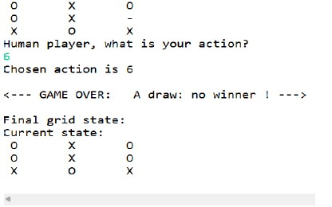
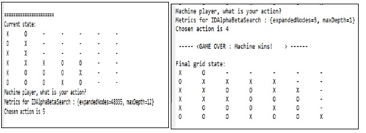

As part of the artificial intelligence course at the Ecole des Mines de Saint-étienne, we implement here a model of the [tic-tac-toe game](https://en.wikipedia.org/wiki/Tic-tac-toe) (called also 'morpion' or '3 pions'), [connect four](https://en.wikipedia.org/wiki/Connect_Four)('puissance 4) and [nim game](https://en.wikipedia.org/wiki/Nim) using adversarial search algotithms: Minimax, Alpha-Beta pruning and Iterative deepening.

The course is given by: [Flavien Balbo](https://www.emse.fr/~flavien.balbo/) ( (Gauthier Picard)[https://www.gauthier-picard.info/previouly]) b

Here is his statement of the problem: https://www.emse.fr/~picard/cours/ai/adversarial/index.html

The source files were written by Pr. Gauthier PICARD (inspired from the algorithm provided by AIMA-Java Project), then completed by us following the exercices presented in the previous link. 

I realised the modelisation of the games and definded the heuristic (utility function that plays a similar role as a reward signal) in order to apply adversial search algorithms (Minimax, Alpha-Beta pruning and Iterative deepening).

The files are to be found in the src folder of the Java Project.

adversarial/connectFour : Folder of the Connect four game, contains the game implementation ConnectFourGame.java, and the gameplay file (which is to execute to try the game) ConnectFourGamePlay.java .

adversarial/tictactoe : Folder of the tic-tac-toe game, contains the game implementation TicTacToeGame.java, and the gameplay file (which is to execute to try the game) TicTacToeGamePlay.java .

adversarial/nim : Folder of  nim game, contains the game implementation NimGame.java, and the gameplay file (which is to execute to try the game) NimGamePlay.java .

util contains a simple example of the maximin search algorithm with and without alpha-beta pruning, it is applied in a simple 2-depth tree.

adversarial contains the interfaces of the game and the search algorithms (AdversarialSearch.java, Game.java). And the search algorithms ready to use : MinimaxSearch.java, AlphaBetaSearch.jave, IterativeDeepeningAlphaBetaSearch.java .

adversarial/core contains Metrics.java which calculates the number of expanded nodes by a used search algorithm.

## Games modelization

## 1. Tic-tac-toe

We represent a **state** in the game by a vector **S** of Ex 3*3+1=10 elements:
* S[0]∈ {−1,1} indicates which player has to play at the current state.
* The  9 other integers describe the board game:
	* S[k]==0 : The cell (i,j) is empty (where k=3*i+j, with i is the row number and j the colum number. i, j∈{0,1,2})
	* S[k]==1  : the k-th cell is occupied by a nought (O)
	* S[k]==-1 : the k-th cell is occupied by a cross (X)

A the beginning of the game: S[0]=1 (the player using noughts begins the game), all cells are empty (for all k>=1, S[k]=0 ).

An **action** consists on chosing where to place a pawn (cross or nought) in one of the unoccupied cells. We display here the display during a game session. ("-" indicates an empty cell).

*Screen display during game*

### Strategy: utility function
We use this foollowing heuristic *H* for tic-tac-toe:
* H(n)=+∞    if the player wins (i.e. its 3 pawns are aligned)
* H(n) =-∞   if the player loses (the 3 pawns of the opponent are aligned)
* H(n) = NumberOfAlinedPawnsPlayer - NumberOfAlinedPawnsOpponent    otherwise

This simple utility function allows the "AI" player to maximize its aligned pieces while minimizing the one of its opponent. Since the ric-tac-toe game is enough simple (the search space is enough small to be exhaustively explored by brute force), with this strategy enables the agent to get draw at least in all the tests (one can execute the file: adversarial/tictactoe/TicTacToeGamePlay.java to try).

## 2. Connect four
In Connect four the objective is to align 4 pieces (horizontally, vertically or obliquely).
Similarly to the tic-tac-toe game, we represent each state *S* by of 6*7+1=43 elements :
* S[0]∈{−1,1} indicates which player has to take an action at the current state.
* The  9 other integers describe the board game:
	* S[k]==0 : The cell (i,j) is empty (where k=6*i+j, with i is the row number and j the colum number. i∈{0,1,...,5} and j∈{0,1,...,6})
	* S[k]==1  : the k-th cell is occupied by a nought (O)
	* S[k]==-1 : the k-th cell is occupied by a cross (X)

The main difference with tic-tac-toe is the effect of gravity. A player cannot chose any cell in the grid. It can only choses a column j ∈{𝟏,𝟐,...,𝟕}: the piece will fall from the top until it encounters another piece or it reach the floor (level i=0).

We use the same utility function as in tac-toe-toe (see above).

*Screen display during game*

